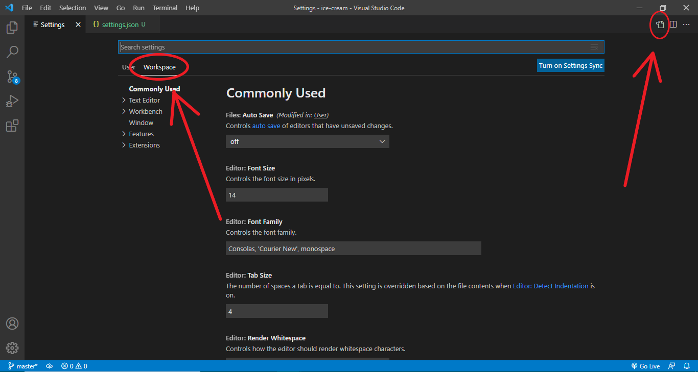
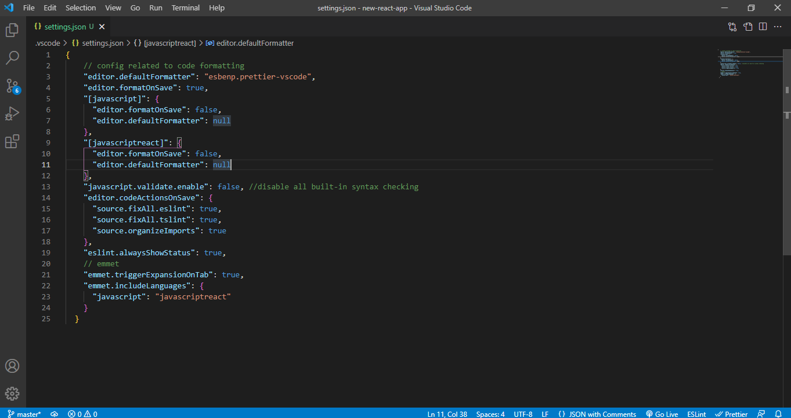

### Create React App

Open **terminal** and 'cd' into the folder where you want your project to reside & enter the below command in your terminal:

```bash
npx create-react-app new-react-app
```

This will create a new folder called "new-react-app" and install everything required to start a new react application.

## Editor Setup

### Settings

Edit the VS Code settings.json file by simply go to File **>** Preferences **>** Settings **>** Workspace **>** Open Settings (JSON)
Then **Copy and Paste bellow code**

```json
{
    // config related to code formatting
    "editor.defaultFormatter": "esbenp.prettier-vscode",
    "editor.formatOnSave": true,
    "[javascript]": {
      "editor.formatOnSave": false,
      "editor.defaultFormatter": null
    },
    "[javascriptreact]": {
      "editor.formatOnSave": false,
      "editor.defaultFormatter": null
    },
    "javascript.validate.enable": false, //disable all built-in syntax checking
    "editor.codeActionsOnSave": {
      "source.fixAll.eslint": true,
      "source.fixAll.tslint": true,
      "source.organizeImports": true
    },
    "eslint.alwaysShowStatus": true,
    // emmet
    "emmet.triggerExpansionOnTab": true,
    "emmet.includeLanguages": {
      "javascript": "javascriptreact"
    }
  }
```





## Linting Setup

In order to lint and format your React project automatically according to popular airbnb style guide, I recommend you to follow the instructions below.

### Install Dev Dependencies

```sh
yarn add -D prettier
yarn add -D babel-eslint
npx install-peerdeps --dev eslint-config-airbnb
yarn add -D eslint-config-prettier eslint-plugin-prettier
```

or You can also add a new script in the scripts section like below to install everything with a single command:

```json
scripts: {
    "lint": "yarn add -D prettier && yarn add -D babel-eslint && npx install-peerdeps --dev eslint-config-airbnb && yarn add -D eslint-config-prettier eslint-plugin-prettier"
}
```

and then simply run the below command in the terminal -

```sh
yarn lint #or 'npm run lint'
```
- In package.json, update the line "babel-eslint": "^10.0.2", to "@babel/eslint-parser": "^7.5.4",. This works with the code above but it may be better to use the latest version, which at the time of writing is 7.16.3.

and then simply run the below command in the terminal -
```sh
npm i
```

### Create Linting Configuration file manually

Create a `.eslintrc` file in the project root and enter the below contents:

```json
{
    "extends": [
      "airbnb",
      "airbnb/hooks",
      "eslint:recommended",
      "prettier",
      "plugin:jsx-a11y/recommended"
    ],
    "parser": "@babel/eslint-parser",
    "parserOptions": {
      "ecmaVersion": 8,
      "requireConfigFile": false,
      "babelOptions": {
        "presets": ["@babel/preset-react"]
     }
    },
    "env": {
      "browser": true,
      "node": true,
      "es6": true,
      "jest": true
    },
    "rules": {
      "react/react-in-jsx-scope": 0,
      "react-hooks/rules-of-hooks": "error",
      "no-console": 0,
      "react/state-in-constructor": 0,
      "indent": 0,
      "linebreak-style": 0,
      "react/prop-types": 0,
      "jsx-a11y/click-events-have-key-events": 0,
      "react/jsx-filename-extension": [
        1,
        {
          "extensions": [".js", ".jsx"]
        }
      ],
      "prettier/prettier": [
        "error",
        {
          "trailingComma": "es5",
          "singleQuote": true,
          "printWidth": 100,
          "tabWidth": 4,
          "semi": true,
          "endOfLine": "auto"
        }
      ]
    },
    "plugins": ["prettier", "react", "react-hooks"]
  }
```

- **Edit Something and wait for sometime for complete setup**...

**Thank You**

