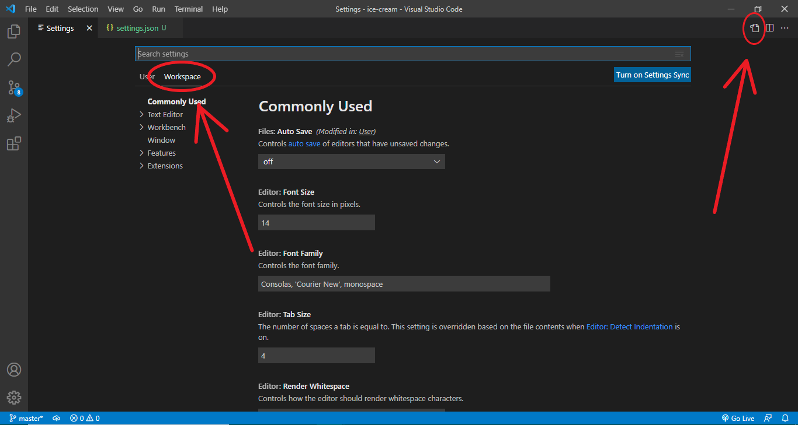
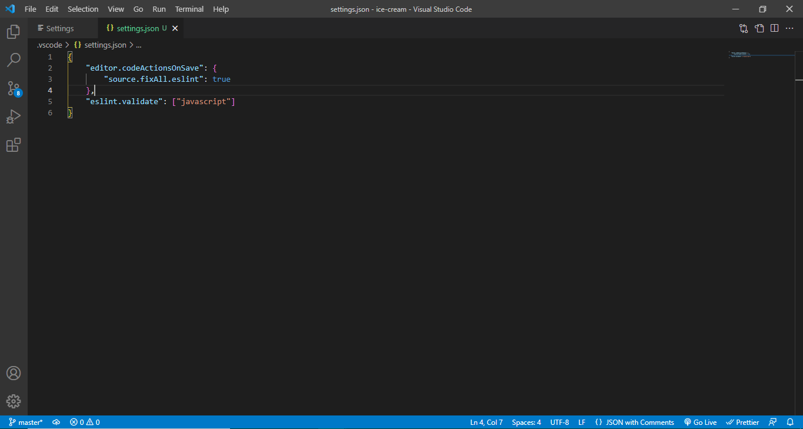
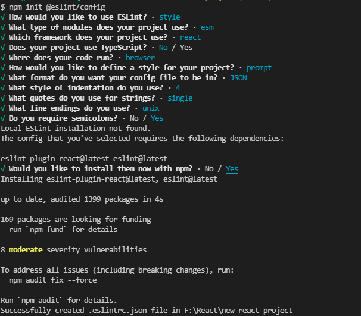

### Create React App

Open terminal and 'cd' into the folder where you want your project to reside & enter the below command in your terminal:

```bash
npx create-react-app new-react-project
```

This will create a new folder called "new-react-project" and install everything required to start a new react application.

## Editor Setup

### Settings

Edit the VS Code settings.json file by simply go to File > Preferences > Settings > Workspace > Open Settings (JSON)
Then Copy and Paste bellow code

```json
{
    "editor.codeActionsOnSave": {
        "source.fixAll.eslint": true
    },
    "eslint.validate": ["javascript"]
}
```





## Linting and auto Formatting Setup

- Open terminal and cd into the project directory
- enter below command

```bash
npm init @eslint/config
```

Answer This Questions:
- How would you like to use ESLint?  **Ans:** To check syntax, find problems, and enforce code style
- What type of modules does your project use?  **Ans:** JavaScript modules (import/export)
- Which framework does your project use?  **Ans:** React
- Does your project use TypeScript?  **Ans:** No
- Where does your code run?  **Ans:** Browser
- How would you like to define a style for your project?  **Ans:** How would you like to define a style for your project?
- What format do you want your config file to be in?  **Ans:** JSON
- What style of indentation do you use?  **Ans:** Spaces
- What quotes do you use for strings?  **Ans** Single
- What line endings do you use?  **Ans** Unix
- Do you require semicolons?  **Ans** Yes
- Would you like to install them now with npm?  **Ans** Yes




- Open package.json file
- Add lint and lint-fix properties in scripts object

```json
"scripts": {
    "lint": "eslint src/**/*.js",
    "lint-fix": "eslint src/**/*.js --fix"
  },
```

- Open .eslintrc.json file
- Copy and Paste bellow code

```json
{
    "env": {
        "browser": true,
        "es2021": true,
        "jest":true
    },
    "extends": [
        "eslint:recommended",
        "plugin:react/recommended"
    ],
    "settings": {
        "react": {
            "version": "latest"
        }
    },
    "parserOptions": {
        "ecmaFeatures": {
            "jsx": true
        },
        "ecmaVersion": "latest",
        "sourceType": "module"
    },
    "plugins": [
        "react"
    ],
    "rules": {
        "react/react-in-jsx-scope": "off",
        "indent": [
            "error",
            4
        ],
        "linebreak-style": [
            "error",
            "unix"
        ],
        "quotes": [
            "error",
            "single"
        ],
        "semi": [
            "error",
            "always"
        ]
    }
}
```

- create new file inside the project root folder called '.eslintignore'
- write below lines inside .eslintignore file

```txt
src/setupTests.js
public/*
```

- Open terminal and cd into the project directory
- Enter below command

```bash
npm run lint
```

- When the above one finishes, enter the below command

```bash
npm run lint-fix
```

